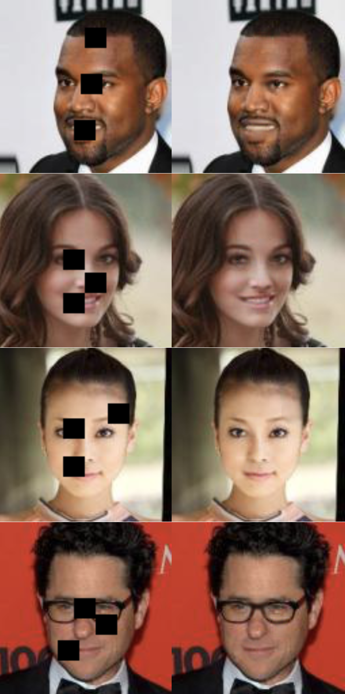

# IC-GAN
IC-GAN is a generative adversarial network designed to complete missing regions in images.
It was implemented in Python3 with TensorFlow.

The network was designed and implemented as part of my 3rd year dissertation project for my undergraduate degree in computer science.

## Results

The network was trained on two datasets, Celeb-A and Places2.
Below are some examples of the results obtained.

  

NOTE: For the places2 examples, the top left image illustrates the location of the patch that was removed and then completed by the network for all subsequent images.

